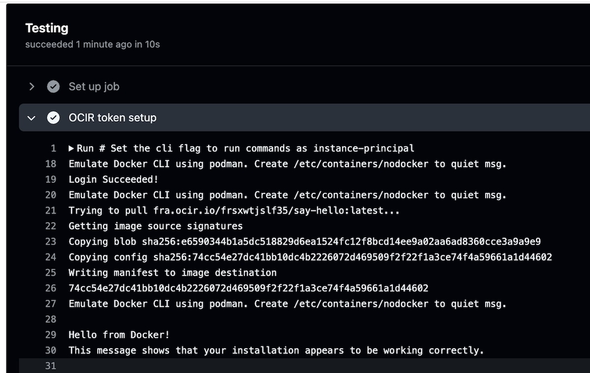

# GitHub Actions example with OCI Runner using a short-lived token for OCI Registry (Docker image registry)

## Instructions to test this

### Fork this repo

### Setup self-hosted runner to the new repo

Setup manually or use this repo to setup a runner via Terraform: https://github.com/mikarinneoracle/GitHub-Actions-Runner-OCI-setup

Terraform setup takes 5-10mins to complete after which the runner becomes visible in your repo

### Modify the OCIR image to test
Change the line #31 to pull something that exists as private repo in your tenancy OCIR, I have pushed hello-world from Dockerhub
https://github.com/mikarinneoracle/actions-example-with-OCI-runner/blob/main/.github/workflows/main.yml#L31

Result should be something like:

